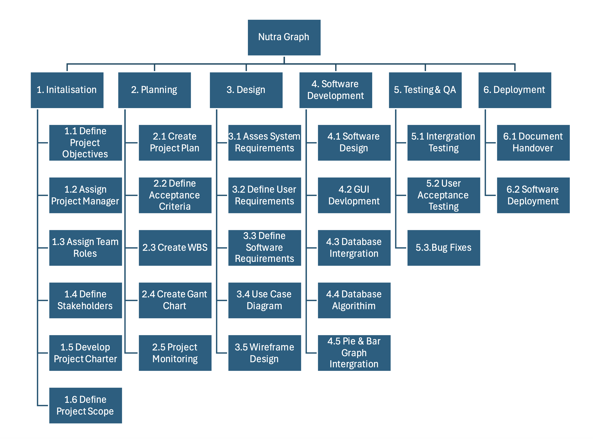
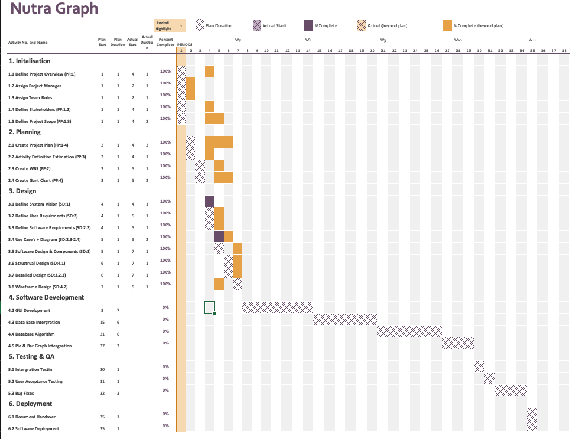

# Project Plan

## Project Name: Nutra Graph 
## Group Number: 006

### Team members

| Student No.  | Full Name              | GitHub Username | Contribution (sum to 100%) | 
|--------------|------------------------|-----------------|----------------------------|
| s5369275     | Luke Hewitt            | JavaTheHut17    | Equal                      |
| s5396486     | Muhammad Budiman       | M-HaekalAdlan   | Equal                      | 
| s5391821     | Ned Keyte              | nedkeyte        | 0%                         | 

### Brief Description of Contribution

Please Describe what you have accomplished in this group project:

- s5369275, Luke Hewitt
  - Accomplishments: Project Plan 1 - 4.
  
- s5396486, Muhammad Budiman
  - Accomplishments: Software Design 1 - 2.4 + 4.2.
  
- s5391821, Ned Keyte
  - Accomplishments: Software Design 3.1 - 4.1.

# Table of Contents

* [Project Plan](#project-plan)
  * [1. Project Overview](#1-project-overview)
    * [1.1 Project Objectives](#11-project-objectives)
    * [1.2 Project Stakeholders](#12-project-stakeholders)
    * [1.2.1 Internal Stakeholders](#121-internal-stakeholders)
    * [1.2.2 External Stakeholders](#122-external-stakeholders)
  * [1.3 Project Scope](#13-project-scope)
    * [1.3.1 Scope Statement](#131-scope-statement)
    * [1.3.2 Project Deliverables](#132-project-deliverables)
    * [1.3.3 Project Acceptance Criteria](#133-project-acceptance-criteria)
    * [1.3.4 Project Exclusions](#134-project-exclusions-)
  * [2. Work Breakdown Structure](#2-work-breakdown-structure)
  * [3. Activity Definition Estimation](#3-activity-definition-estimation)
  * [4. Gantt Chart](#4-gantt-chart)

## 1. Project Overview

### 1.1 Project Objectives

The objective of this project (Nutra Graph) is to develop a food and nutrition software that showcases the visualisation of data in relation to a global food nutritional database containing various food from around the world. The project will use python to build a GUI that will display this data in a graphical format. The information contained in this database can be utilised for a wide variety of health and medical research applications.

### 1.2 Project Stakeholders

### 1.2.1 Internal Stakeholders
 
1. Development team 

    - Project Manager: Oversight and coordination of the project, responsible for planning project timeline leasing with clients and ensuring milestones are planned and met.
    - Developer: Developing the front-end & back-end of the software in relation to the client and designers specifications.
    - Design Team: Responsible for the overall UI/GUI design of the project creating a friendly and easy to use interface.
   
2. Executives

    - Directors: Oversee projects and ensure projects are inline with company goals, while providing resources to teams.
    - Board Members: Hold stake in the project, oversee projects results.

3. Marketing Team 

    - Marketing Manager: Oversight of marketing on projects while ensuring project aligns with company goals, interprets customer data to determine what features will improve customer satisfaction.
    - Marketing Associate: Assist in marketing campaigns for the company and projects while assisting the marketing manager in content creation & customer feedback.

4. IT Support 

    - Customer Support Team: Responsible for supporting customer inquires and troubleshooting customer issues with the software.
    - Quality Assurance Team: Responsible for testing the software and ensuring that it meets the required standards, usability & security requirements of the Project.

### 1.2.2 External Stakeholders

1. Clients

    - End Users: Nutritionists, dietitians, healthcare professionals
    - Organisations: Universities, Hospitals, Medical Facilities, 
    - Public: Individuals 

2. Investors 

    - Investors: Providing financial stake in the project.

## 1.3 Project Scope

### 1.3.1 Scope Statement

Nutra Graph will be designed to utilise nutritional databases and provide a graphical breakdown of the data allowing healthcare professionals, and others to easily distinguish patterns and common occurrences in the data relevant to their field.

### 1.3.2 Project Deliverables

1. Functions:

    - Search Food items: The project will provide a search bar that will enable users to search for specific types of food in the database.
    - Nutrition Breakdown: The user selects a food item in the database for the software to break down and display in relative means, eg Pie Graph & Bar Graphs.
    - Nutrition Range Filter: Allows the user to select a nutritional component and input a min-max value and have relative foods listed that fall into that category.
    - Nutrition Level Filter: Allows users to filter food based on levels, High ( > 66% ), Medium ( 33% - 66% ) ,Low ( < 33% ) based on Fat, Protein, Carbohydrates, Sugar, and Nutritional Density.
    - Nutrition Component Organiser: Allows user to filter food on the database based on the Highest or Lowest nutritional component eg.. Foods with the highest Magnesium per 100g.

2. Documents/Reports:

    - Project Plan Document
    - Software Design Document
    - Work Breakdown Structure
    - Gant Chart 
    - Use Case Diagram 
    - Software Design Flow Chart 
    - Structural Design Chart
    - Visual Design Wireframe
   

3. Software

    - Nutra Graph Software

### 1.3.3 Project Acceptance Criteria

1. Functionality

    As defined in the Project Deliverables.

    - Nutra Graph must allow users to search for food items in the database and retrieve said items.
    - The software will allow users to select a food and have data displayed in a Pie & Bar Graph format.
    - The software will allow users to select a nutritional component and input a min/max value to list food that falls into the selected range.
    - The software will allow users to filter foods by nutritional content level Low, Medium and High.
    - The software will allow users to filter food in the database based on the Highest or Lowest nutritional component levels, eg.. highest /lowest fat content. 

2. Performance 

    - Software is quick and responsive with sub 2 second search times.
    - Software can handle a large database > 2300 food Items.
    - Software can be used on all major OS, Windows, Mac OS, Linux.

3. User Interface 

    - Software Must be user Friendly, easy to use and navigate.
    - User Friendly design, High contrast colours and clear text.
    - Data must be displayed clearly and in a usable fashion. 

4. Security 

    - User data must be handled correctly and securely, meeting industry standards on encryption.

### 1.3.4 Project Exclusions 

1. Ongoing Maintenance 

    - This software is stand alone and will not undertake any ongoing maintenance or updates from our team once the final product is handed over.

2. Updates To Database 

    - No additional updates to the database will continue once the project is handed over.

3. Mobile Application.

    - This is a standalone software no mobile application will be delivered.

## 2. Work Breakdown Structure

Include the Work Breakdown Structure (WBS) for the entire project. WBS should be presented as a hierarchical diagram. Use the elements from the WBS to define activities in Section 3, and schedule these activities in the Gantt Chart in Section 4. Ensure all project activities are considered and included in the WBS.

## 3. Activity Definition Estimation

Below defines the activity definition estimates for the Nutra Graph project. 

| Activity #No | Activity Name                  | Brief Description                              | Duration | Responsible Team Members |
|--------------|--------------------------------|------------------------------------------------|----------|--------------------------|
| 1.1          | Define Project Overview        | Define Project Overview                        | 2 hrs    | All                      |
| 1.2          | Assign Project Manager         | Assign project manager                         | 1 hrs    | All                      |
| 1.3          | Assign Team Roles              | Assigning team roles                           | 1 hrs    | All                      |
| 1.4          | Define Project Stakeholders    | Defining project stakeholders                  | 2 hrs    | Luke                     |
| 1.5          | Define Project Scope           | Defining Project scope                         | 2 hrs    | Luke                     |
| 2.1          | Create Project Plan            | Creating project plan                          | 3 Day    | Luke                     |
| 2.2          | Activity Definition Estimation | Estimating Activity Times                      | 1 Day    | Luke                     |
| 2.3          | Create WBS                     | Creating Work Break down Structure             | 1 Day    | Luke                     |
| 2.4          | Create Gantt Chart             | Creating Gantt Chart                           | 2 Day    | Luke                     |
| 3.1          | Define System Vision           | Defining System Vision                         | 1 Day    | Muhammad                 |
| 3.2          | Define User Requirements       | Defining User requirements                     | 1 Day    | Muhammad                 |
| 3.3          | Define Software Requirements   | Defining software requirements for the system. | 1 Day    | Muhammad                 |
| 3.4          | Use case's + Diagram           | Create the Use cases for the system & Diagram  | 2 Day    | Muhammad                 |
| 3.5          | Software Design & Components   | Software Design flow chart + System Components | 1 Day    | Ned                      |
| 3.6          | Structural Design              | Defining Data Structure + data sources         | 1 Day    | Ned                      |
| 3.7          | Detailed Design                | Sudo code for software functions               | 1 Day    | Ned                      |
| 3.8          | Wireframe Design               | Wireframe design of GUI                        | 1 Day    | Muhammad                 |
| 4.1          | GUI Development                | GUI Development                                | 7 Day    | All                      |
| 4.2          | Database Integration           | Database integration                           | 7 Day    | All                      |
| 4.3          | Database Algorithm             | Algorithm and sorting of database              | 6 Day    | All                      |
| 4.4          | Pie & Bar Graph Integration    | Integration of Pie and bar graph for project   | 3 Day    | All                      |
| 5.1          | Integration Testing            | Testing of software                            | 1 Day    | All                      |
| 5.2          | User Acceptance Testing        | User Acceptance Testing                        | 1 Day    | All                      |
| 5.3          | Bug Fixes                      | rectification of any bugs in software.         | 3 Day    | All                      |
| 6.1          | Document Handover              | Submission                                     | 2 hrs    | All                      |
| 6.2          | Software Deployment            | Software Deployment                            | 2 hrs    | All                      |

## 4. Gantt Chart

Please see below the proposed Gantt Chart for Nutra Graph. 

