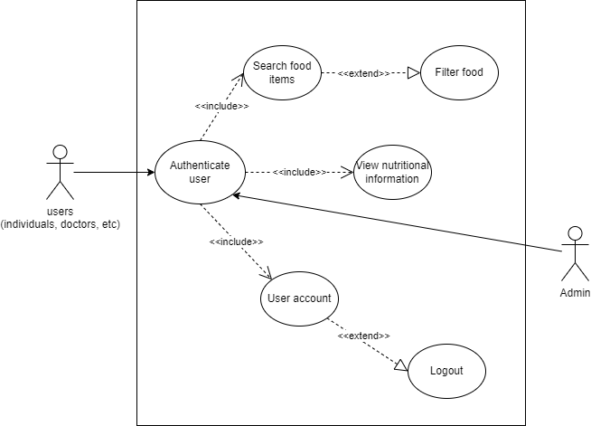
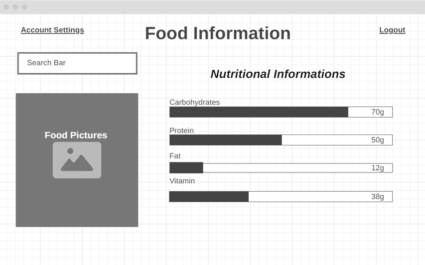

# Software Design Document

## Project Name: Nutra Graph
## Group Number: 006

### Team members

| Student No. | Full Name             | GitHub Username | Contribution (sum to 100%) | 
|-------------|-----------------------|-----------------|----------------------------|
| s5369275    | Luke Hewitt           | JavaTheHut17    | 33.3% or Equal             |
| s222222     | Muhammad Budiman      | M-HaekalAdlan   | 33.3% or Equal             | 
| s333333     | Ned Keyte             | nedkeyte        | 33.3% or Equal             | 

# Table of Contents

<!-- TOC -->
* [Table of Contents](#table-of-contents)
  * [1. System Vision](#1-system-vision)
    * [1.1 Problem Background](#11-problem-background)
    * [1.2 System capabilities/overview](#12-system-capabilitiesoverview)
    * [1.3	Potential Benefits](#13potential-benefits)
  * [2. Requirements](#2-requirements)
    * [2.1 User Requirements](#21-user-requirements)
    * [2.2	Software Requirements](#22software-requirements)
    * [2.3 Use Case Diagrams](#23-use-case-diagrams)
    * [2.4 Use Cases](#24-use-cases)
  * [3.	Software Design and System Components](#3-software-design-and-system-components-)
    * [3.1	Software Design](#31software-design)
    * [3.2	System Components](#32system-components)
      * [3.2.1 Functions](#321-functions)
      * [3.2.2 Data Structures / Data Sources](#322-data-structures--data-sources)
      * [3.2.3 Detailed Design](#323-detailed-design)
  * [4. User Interface Design](#4-user-interface-design)
    * [4.1 Structural Design](#41-structural-design)
    * [4.2	Visual Design](#42visual-design)
<!-- TOC -->

## 1. System Vision

### 1.1 Problem Background

  A lot of people find it hard to keep track of their diet. This software application will help people to access accurate information
  regarding of foods they consume in order to support their diet progress, macro nutrients, and overall health from dataset
  this application provides.

  The dataset used for this software is a comprehensive foods nutritional database from all around the world. This dataset
  provides more than 30 attributes for each food item, such as calories, carbohydrates, protein, sugar, calcium, etc. 
  User can input what food they want to see in search query, and the system will provide all the information based on the input.
  
  Target user for this software application are:
  1. Individuals: People who trying to monitor their food intake or keep track of their diet
  2. Healthcare Professionals: Doctors, dietitians, and nutritionists can use this software to help them give proper
      nutritional content to their patients.
  3. Researcher: They can use this software for their data collection and analysis.

### 1.2 System capabilities/overview

  This software has multiple functionalities that can help the convenience for users, such as:
1.	Food Item Search: Users will be able to find specific food they want to know by write the food name in the search box.
2.	Nutritional Breakdown: The system will provide a detailed nutritional breakdown for every food items.
3.	Filtering and Sorting: Users able to filter and sort items by various criteria based on their preference, such as: high-protein, low fat

### 1.3	Benefit Analysis

This software offers several key benefits, such as:
1.	Convenience: Users can access this software from anywhere as long they have internet connections .
2.	Health and societal impact: This software promote better nutrition habits and public health awareness.
3.	Accurate information: Users will get accurate information regarding nutritional content of foods to make healthier choice.

## 2. Requirements

### 2.1 User Requirements

Here are some examples describing the functionalities from the end-user’s perspective
#### Fictional user:

A. John Thompson – fitness enthusiast
•	Age: 26
•	Needs: Want to focus on his diet. Need to find high-protein, low-fat foods for his macronutrient daily intake
Expected user interactions:
1.	Searching and filtering for food items

•	Description: John will be able to search for high-protein, low-fat food, and the system will retrieve all the food that have that criteria.

•	User need:

o	Simple search interface

o	Quick search result

o	Filtering options based on nutrients values
2.	Detailed nutritional information

•	Description: John will get detail information about his food item, such as calories, fat, carbohydrates, proteins, fiber, etc.

•	User need: 

o	Clear and detailed nutritional data

o	Easy to understand breakdown of macronutrients

### 2.2	Software Requirements
Define the functionality the software will provide. This section should list requirements formally, often using the word "shall" to describe functionalities.

Example Functional Requirements:  
- R1.1 The program shall accept multiple file names as arguments from the command line.  
- R1.2 Each file name can be a simple file name or include the full path of the file with one or more levels.  

- etc …

### 2.3 Use Case Diagram
 

### 2.4 Use Cases
Include at least 5 use cases, each corresponding to a specific function.

| Use Case ID    | 01                                                                                                                                                                                                          |
|----------------|-------------------------------------------------------------------------------------------------------------------------------------------------------------------------------------------------------------|
| Use Case Name  | Search for food items                                                                                                                                                                                       |
| Actors         | Individuals, doctor, nutritionist, researcher                                                                                                                                                               |
| Description    | The user searches for a specific food item by name or category to retrieve its detailed nutritional information.                                                                                            |
| Flow of Events | 1.  The user enters a food item name or selects a category. 2. The system retrieves matching food items from the database. 3. The system displays the food items along with their basic nutritional details. |
                                                                                                                                                                                                                                                                            |

| Use Case ID    | 02                                                                                                                                                                                                                         |
|----------------|----------------------------------------------------------------------------------------------------------------------------------------------------------------------------------------------------------------------------|
| Use Case Name  | View detailed nutritional information                                                                                                                                                                                      |
| Actors         | Individuals, doctors, nutritionist, researcher                                                                                                                                                                             |
| Description    | The user views the detailed nutritional profile of a selected food item, including macronutrients and micronutrients.                                                                                                      |
| Flow of Events | 1. The user selects a food item to view its nutritional profile. 2. The system retrieves the full nutritional breakdown (macronutrients, micronutrients, etc.). 3. The system displays the nutritional profile to the user. |
                                       |

| Use Case ID    | 03                                                                                                                                                                                                                                                                                                                                                       |
|----------------|----------------------------------------------------------------------------------------------------------------------------------------------------------------------------------------------------------------------------------------------------------------------------------------------------------------------------------------------------------|
| Use Case Name  | Track nutritional goals                                                                                                                                                                                                                                                                                                                                  |
| Actors         | Individual (fitness enthusiast), nutritionist                                                                                                                                                                                                                                                                                                            |
| Description    | The user tracks their daily or weekly intake of nutrients (e.g., calories, protein, fats) and views their progress towards specific dietary goals.                                                                                                                                                                                                       |
| Flow of Events | 1. The user adds food items to their daily nutritional log. 2. The system calculates the total intake of calories, protein, fats, carbohydrates, and other nutrients. 3. The system displays progress towards the user’s nutritional goals (e.g., calories consumed vs. goal). 4. The user views a summary of their daily or weekly intake and progress. |
                               

| Use Case ID    | 04                                                                                                                                                                                                                                                                                                     |
|----------------|--------------------------------------------------------------------------------------------------------------------------------------------------------------------------------------------------------------------------------------------------------------------------------------------------------|
| Use Case Name  | Save and Revisit Food Preferences                                                                                                                                                                                                                                                                      |
| Actors         | Individuals, nutritionist, doctors                                                                                                                                                                                                                                                                     |
| Description    | The user saves specific food items or searches and revisits them later for easy access to frequently used nutritional data.                                                                                                                                                                            |
| Flow of Events | 1. The user selects a food item or search and saves it to their account. 2. The system stores the saved item or search in the user's account. 3. The user logs in at a later time and accesses the saved searches or food items. 4. The system displays the saved information for the user’s reference |
                                                                                                                                                                                                                                                                                                |

| Use Case ID    | 05                                                                                                                                                                                                                                                                                                                                                |
|----------------|---------------------------------------------------------------------------------------------------------------------------------------------------------------------------------------------------------------------------------------------------------------------------------------------------------------------------------------------------|
| Use Case Name  | Filter Food Items by Nutritional Content                                                                                                                                                                                                                                                                                                          |
| Actors         | Individuals, nutritionist, doctors                                                                                                                                                                                                                                                                                                                |
| Description    | The user filters food items based on specific nutritional criteria, such as low-fat, high-protein, or vitamin-rich foods.                                                                                                                                                                                                                         |
| Flow of Events | 1. The user selects specific filtering criteria for food items (e.g., low-carb, rich in iron). 2. The system filters the database for food items that match the selected criteria. 3. The system displays the filtered food items that meet the nutritional criteria. 4. The user can further refine or select food items from the filtered list. |

## 3.	Software Design and System Components 

### 3.1	Software Design
Include a flowchart that illustrates how your software will operate.

Example:  

### 3.2	System Components

#### 3.2.1 Functions
List all key functions within the software. For each function, provide:
- Description: Brief explanation of the function’s purpose.
- Input Parameters: List parameters, their data types, and their use.
- Return Value: Describe what the function returns.
- Side Effects: Note any side effects, such as changes to global variables or data passed by reference.

#### 3.2.2 Data Structures / Data Sources
List all data structures or sources used in the software. For each, provide:

- Type: Type of data structure (e.g., list, set, dictionary).
- Usage: Describe where and how it is used.
- Functions: List functions that utilize this structure.

#### 3.2.3 Detailed Design
Provide pseudocode or flowcharts for all functions listed in Section 3.2.1 that operate on data structures. For instance, include pseudocode or a flowchart for a custom searching function.

## 4. User Interface Design

### 4.1 Structural Design
Present a structural design, a hierarchy chart, showing the overall interface’s structure. Address:

- Structure: How will the software be structured?
- Information Grouping: How will information be organized?
- Navigation: How will users navigate through the software?
- Design Choices: Explain why these design choices were made.

Example:  

### 4.2	Visual Design

