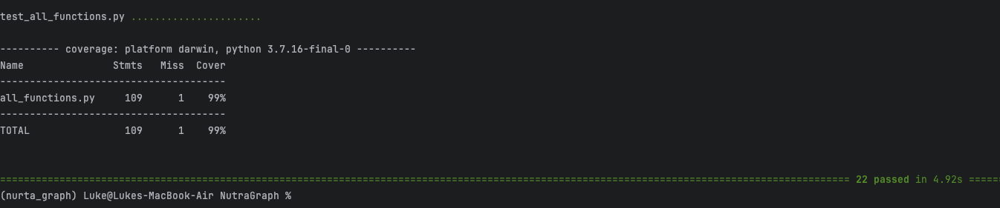
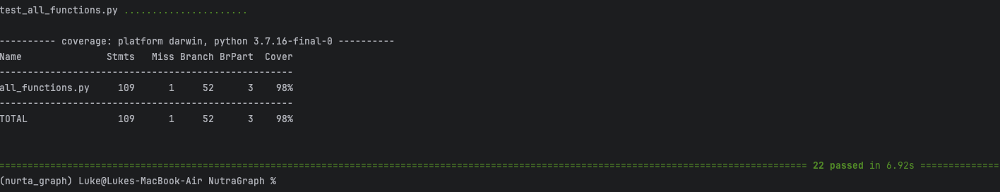

# Coverage Testing Report

### GitHub Repository URL: https://github.com/JavaTheHut17/SoftTech_Group_06

---

## 1. **Test Summary**
list all tested functions related to the five required features, for example:

| **Tested Functions**    |
|-------------------------|
| `search_food()`         | 
| `nutrition_breakdown()` |
| `range_filter()`        |
| `high_med_low_filter()` |
| `high_low_filter()`     |
---

## 2. **Statement Coverage Test**

### 2.1 Description

To achieve full test coverage, we designed and implemented each function separately and then wrote corresponding test cases for each function to ensure proper validation of their functionality, before adding and implementing all functions into 
test_all_functions.py.

### 2.2 Testing Results

## 3. **Branch Coverage Test**

### 3.1 Description

We designed the test cases for test-all-functions.py individually to ensure that all functions where tested to 
100% coverage, this approach helped us to achieve a very high coverage score. 

### 3.2 Testing Results

