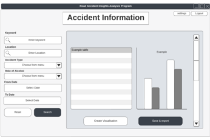

# Executive Summary

### GitHub Repository URL: https://github.com/JavaTheHut17/SoftTech_Group_06

---

You should use your software to prepare an executive summary as outlined below for the five required features.

## 1. [Feature 1 Name]
### Description  
Briefly describe what this feature does.

### Steps
1. Step-by-step instructions for using this feature.
2. Add additional steps as needed.

### Screenshots
Include screenshots for each step demonstrating the use of this feature.  

---

## 2. [Feature 2 Name]
### Description  
Briefly describe what this feature does.

### Steps
1. Step-by-step instructions for using this feature.
2. Add additional steps as needed.

### Screenshots
Include screenshots for each step demonstrating the use of this feature.  

---

## 3. Range Filter
### Description  
Filters food by a nutritional component of choice via a selected range.

### Steps
1. Input nutritional component into search bar
2. select Range Filter via the drop-down bar 
3. Input Max and Min values into corresponding Min and Max text input boxes 
4. Click Submit Button 

### Screenshots
Range Filter screen shots:

---

## 4. High Medium Low Filter
### Description  
Filters food by a nutritional component of choice via of High 66% , Medium 66% - 33% or low >33% range.

### Steps
1. Input nutritional component into search bar
2. select High med low filter from drop down bar.
3. Toggle either, high medium or low button.
4. Submit

### Screenshots
High Medium Low filter screen shots:

---

## 5. High Low Filter
### Description  
Filters food by a nutritional component of choice via the highest or lowest value in the database.

### Steps
1. Input nutritional component into search bar.
2. select High low filter from dropdown bar.
3. toggle either high or low button.
4. Click Search.

### Screenshots
High low filter screenshots:

---
