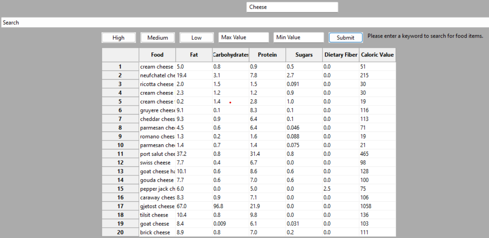
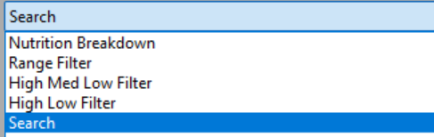
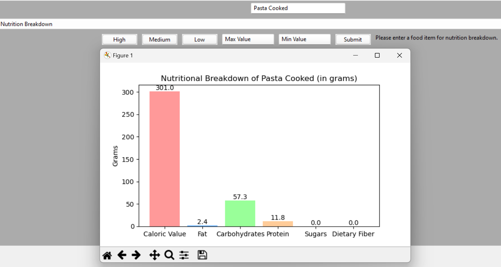
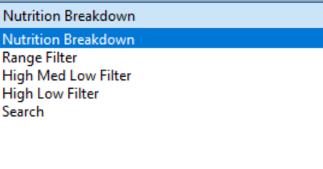
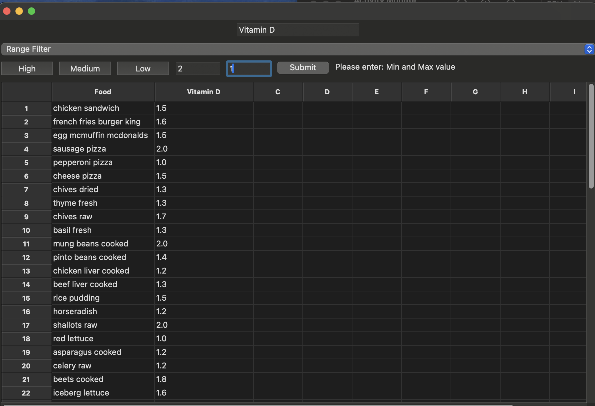
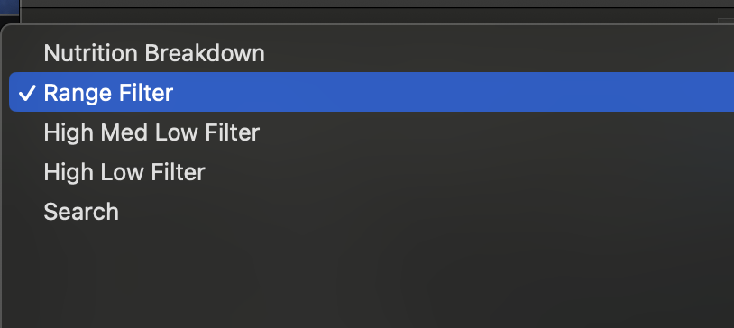
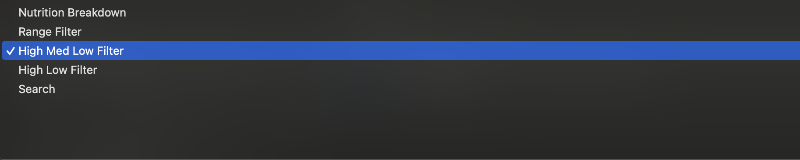
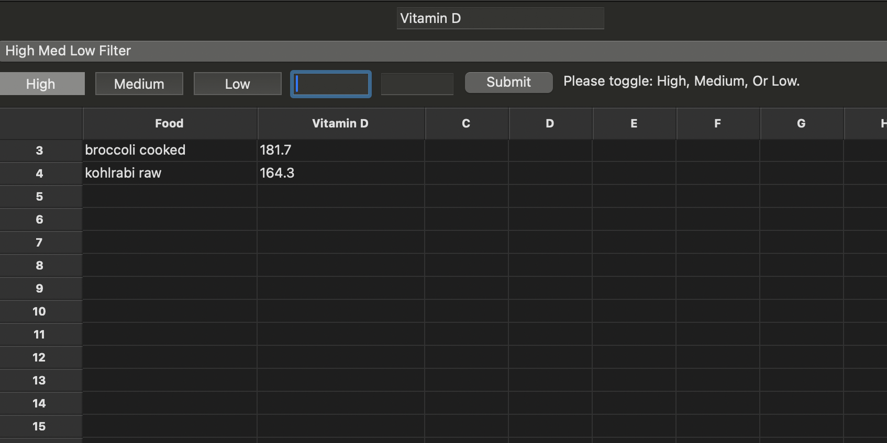
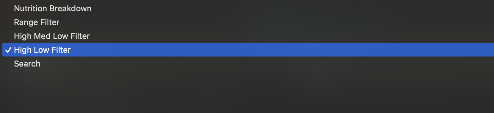
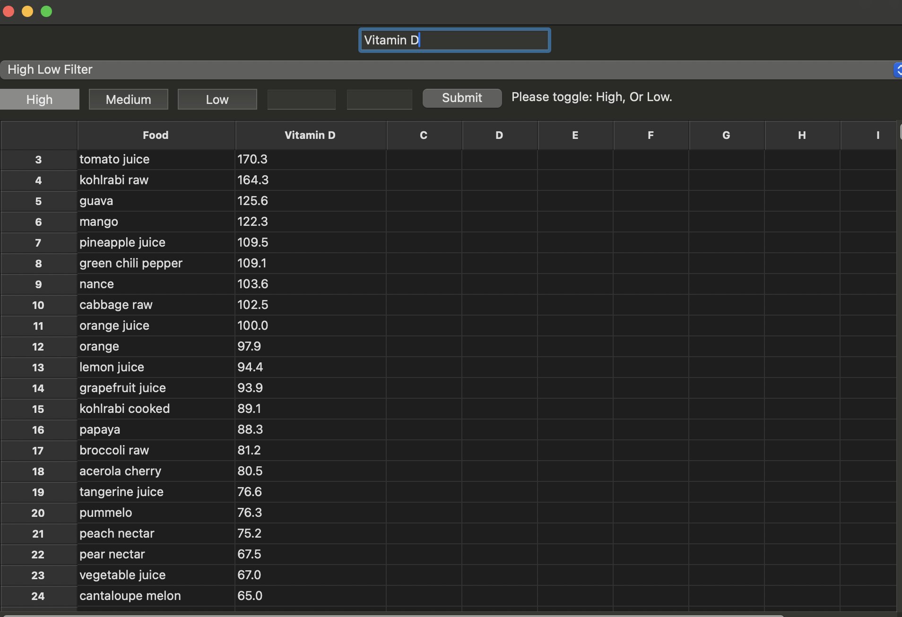

# Executive Summary

### GitHub Repository URL: https://github.com/JavaTheHut17/SoftTech_Group_06

---

You should use your software to prepare an executive summary as outlined below for the five required features.

## 1. Search Food Items
### Description  
This feature allows users to search for a specific food in the database by typing it in the search box.

### Steps
1. Type the food name in the search box
2. select 'search' via the drop-down bar
3. click submit button

### Screenshots
Include screenshots for each step demonstrating the use of this feature.  

---

## 2. Nutrition Breakdown
### Description  
The nutrition breakdown function takes a selected food item from the dataset and displays its detailed nutritional values such as caloric value, fat, carbohydrates, protein, sugars, and dietary fiber in a bar graph.

### Steps
1. input the food name in the search box
2. select nutritional breakdown via drop-down bar
3. click submit

### Screenshots
Include screenshots for each step demonstrating the use of this feature.  

---

## 3. Range Filter
### Description  
Filters food by a nutritional component of choice via a selected range.

### Steps
1. Input nutritional component into search bar
2. select Range Filter via the drop-down bar 
3. Input Max and Min values into corresponding Min and Max text input boxes 
4. Click Submit Button 

### Screenshots
Range Filter screen shots:

---

## 4. High Medium Low Filter
### Description  
Filters food by a nutritional component of choice via of High 66% , Medium 66% - 33% or low >33% range.

### Steps
1. Input nutritional component into search bar
2. select High med low filter from drop down bar.
3. Toggle either, high medium or low button.
4. Submit

### Screenshots
High Medium Low filter screen shots:

---

## 5. High Low Filter
### Description  
Filters food by a nutritional component of choice via the highest or lowest value in the database.

### Steps
1. Input nutritional component into search bar.
2. select High low filter from dropdown bar.
3. toggle either high or low button.
4. Click Search.

### Screenshots
High low filter screenshots:

---
