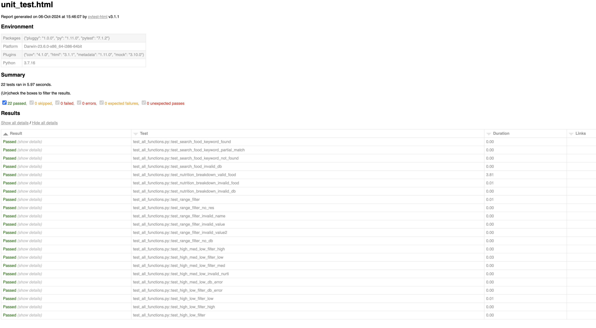

# Unit Testing Report

Please provide your GitHub repository link.
### GitHub Repository URL: https://github.com/XXXX/XXXXX.git

---

The testing report should focus solely on <span style="color:red"> testing all the self-defined functions related to 
the five required features.</span> There is no need to test the GUI components. Therefore, it is essential to decouple your code and separate the logic from the GUI-related code.


## 1. **Test Summary**
list all tested functions related to the five required features and the corresponding test functions designed to test 
those functions, for example:

| **Tested Functions** | **Test Functions**                               |
|----------------------|--------------------------------------------------|
| `add(x1,x2)`         | `test_add_valid()` <br> `test_add_invalid`       |
| `divide(x1,x2)`      | `test_divide_valid()` <br> `test_divide_invalid` |
| `...`                | `...`                                            |

---

## 2. **Test Case Details**

### Test Case 1:
- **Test Function/Module**
  - `test_divide_valid()`
  - `test_divide_invalid()`
- **Tested Function/Module**
  - `divide(a, b)`
- **Description**
  - A brief description of the tested function's usage, including its purpose, input, and output.
- **1) Valid Input and Expected Output**  

| **Valid Input**               | **Expected Output** |
|-------------------------------|---------------------|
| `divide(10, 2)`               | `5`                 |
| `divide(10, -2)`              | `-5`                |
| `add more cases in necessary` | `...`               |

- **1) Code for the Test Function**
```python
def test_divide_valid():
    assert divide(10, 2) == 5
    assert divide(10, -2) == -5
```
- **2) Invalid Input and Expected Output**

| **Invalid Input**             | **Expected Output** |
|-------------------------------|---------------------|
| `divide(10, 0)`               | `Handle Exception`  |
| `add more cases in necessary` | `...`               |

- **2) Code for the Test Function**
```python
def test_divide_invalid():
    with pytest.raises(ValueError) as exc_info:
        divide(10, 0)
    assert exc_info.type is ValueError
```
### Test Case 2:
- **Test Function/Module**
  - `test_divide_valid()`
  - `test_divide_invalid()`
- **Tested Function/Module**
  - `divide(a, b)`
- **Description**
  - A brief description of the tested function's usage, including its purpose, input, and output.
- **1) Valid Input and Expected Output**  

| **Valid Input**               | **Expected Output** |
|-------------------------------|---------------------|
| `divide(10, 2)`               | `5`                 |
| `divide(10, -2)`              | `-5`                |
| `add more cases in necessary` | `...`               |

- **1) Code for the Test Function**
```python
def test_divide_valid():
    assert divide(10, 2) == 5
    assert divide(10, -2) == -5
```
- **2) Invalid Input and Expected Output**

| **Invalid Input**             | **Expected Output** |
|-------------------------------|---------------------|
| `divide(10, 0)`               | `Handle Exception`  |
| `add more cases in necessary` | `...`               |

- **2) Code for the Test Function**
```python
def test_divide_invalid():
    with pytest.raises(ValueError) as exc_info:
        divide(10, 0)
    assert exc_info.type is ValueError
```

### Test Case 3:
- **Test Function/Module**
  - `test_range_filter()`
  - `test_range_filter_no_res()`
  - `test_range_filter_invalid_name()`
  - `test_range_filter_invalid_value()`
  - `test_range_filter_invalid_value2()`
  -  `test_range_filter_no_db()`

- **Tested Function/Module**
  - `range_filter(nutri_component, max_n_value, min_n_value, data)`
- **Description**
- Test the range filter function on a variety of inputs and testcases.
- **1) Valid Input and Expected Output**  

| **Valid Input**                               | **Expected Output**                                                                            |
|-----------------------------------------------|------------------------------------------------------------------------------------------------|
| `range_filter('Vitamin E', 0.08, 0.079, db) ` | `[{'rice bowl with chicken, Vitamin E: 0.08'}, {'strawberry topping, Vitamin E: 0.079'}, ...]` |
| `range_filter('Vitamin D', 300, 230, db) `    | `[]`                                                                                           |


- **1) Code for the Test Function**
```python
def test_range_filter():

  db = 'DataBase/Food_Nutrition_Dataset.csv'

  expect_res = [{'rice bowl with chicken, Vitamin E: 0.08'}, {'strawberry topping, Vitamin E: 0.079'},
                {'instant white rice raw, Vitamin E: 0.079'}, {'strawberries, Vitamin E: 0.079'},
                {'sage ground, Vitamin E: 0.08'}, {'navy beans raw, Vitamin E: 0.08'},
                {'navy beans cooked, Vitamin E: 0.08'}, {'veal thymus cooked, Vitamin E: 0.079'},
                {'fruit yogurt, Vitamin E: 0.079'}, {'instant cappuccino powder, Vitamin E: 0.08'},
                {'pineapple orange juice, Vitamin E: 0.079'}, {'chestnuts roasted, Vitamin E: 0.08'},
                {'hot chile pepper dried, Vitamin E: 0.079'}, {'dried tomatoes, Vitamin E: 0.079'},
                {'shiitake mushrooms cooked, Vitamin E: 0.08'}]

  func_res = range_filter('Vitamin E', 0.08, 0.079, db)

  assert func_res == expect_res

def test_range_filter_no_res():

  expect_res = []

  func_res = range_filter('Vitamin D', 300, 230, 'DataBase/Food_Nutrition_Dataset.csv')

  assert func_res == expect_res

```
- **2) Invalid Input and Expected Output**

| **Invalid Input**                                 | **Expected Output**                                    |
|---------------------------------------------------|--------------------------------------------------------|
| `range_filter('Vitamin Q', 300, 230, db)`         | `"Error: Nutrient component not found in database" `   |
| `range_filter('Vitamin E', '300', 230, db) `      | `"Error: Min and Max value must be integer or float" ` |
| `range_filter('Vitamin E', 300, '230', db) `      | `"Error: Min and Max value must be integer or float" ` |
| `range_filter('Vitamin E', 300, 230, 'DataBase')` | `"Error: DB not found."  `                             |


- **2) Code for the Test Function**
```python
def test_range_filter_no_db():

  expect_res = print("Error: DB not found.")

  func_res = range_filter('Vitamin E', 300, 230, 'DataBase')

  assert func_res == expect_res

  def test_range_filter_invalid_value2():

    expect_res = print("Error: Min and Max value must be integer or float")

    func_res = range_filter('Vitamin E', 300, '230', 'DataBase/Food_Nutrition_Dataset.csv')

    assert func_res == expect_res
def test_range_filter_invalid_value():

  expect_res = print("Error: Min and Max value must be integer or float")

  func_res = range_filter('Vitamin E', '300', 230, 'DataBase/Food_Nutrition_Dataset.csv')

  assert func_res == expect_res

def test_range_filter_invalid_name():

  expect_res = print("Error: Nutrient component not found in database")

  func_res = range_filter('Vitamin Q', 300, 230, 'DataBase/Food_Nutrition_Dataset.csv')

  assert func_res == expect_res

```

### Test Case 4:
- **Test Function/Module**
  - `test_high_med_low_filter_high()`
  - `test_high_med_low_filter_low()`
  - `test_high_med_low_filter_med()`
  - `test_high_med_low_invalid_nurti()`
  - `test_high_med_low_db_error()`
  
- **Tested Function/Module**
  - `high_med_low_filter('Vitamin Q', high=False, med=True, low=False, data='DataBase/Food_Nutrition_Dataset.csv')`
- **Description**
  - To test the high, med, low function of a variety of inputs, high, med, low. 
- **1) Valid Input and Expected Output**  

| **Valid Input**                                                                                                   | **Expected Output**                                                                                                                                             |
|-------------------------------------------------------------------------------------------------------------------|-----------------------------------------------------------------------------------------------------------------------------------------------------------------|
| `high_med_low_filter('Vitamin D', high=True, med=False, low=False, data=db) `                                     | `[{'pokeberry shoots raw, Vitamin D: 217.6'}, {'tomato juice, Vitamin D: 170.3'}, {'broccoli cooked, Vitamin D: 181.7'}, {'kohlrabi raw, Vitamin D: 164.3'}]  ` |
| `high_med_low_filter('Vitamin D', high=False, med=False, low=True, data=db) `                                     | `[{'cream cheese, Vitamin D: 0.0'}, {'neufchatel cheese, Vitamin D: 0.0'},  `                                                                                   |
| `high_med_low_filter('Vitamin D', high=False, med=True, low=False, data='DataBase/Food_Nutrition_Dataset.csv')  ` | `[{'orange, Vitamin D: 97.9'}, {'guava, Vitamin D: 125.6'}, ... `                                                                                               |

- **1) Code for the Test Function**
```python

def test_high_med_low_filter_high():

  expect_res = [{'pokeberry shoots raw, Vitamin D: 217.6'}, {'tomato juice, Vitamin D: 170.3'},
                {'broccoli cooked, Vitamin D: 181.7'}, {'kohlrabi raw, Vitamin D: 164.3'}]

  func_res = high_med_low_filter('Vitamin D', high=True, med=False, low=False, data=db)

  assert func_res == expect_res


def test_high_med_low_filter_low():

  expect_res = [{'cream cheese, Vitamin D: 0.0'}, {'neufchatel cheese, Vitamin D: 0.0'}, {'requeijao cremoso light catupiry, Vitamin D: 0.0'}, {'ricotta cheese, Vitamin D: 0.0'},...]}
  func_res =high_med_low_filter('Vitamin D', high=False, med=False, low=True, data=db)

  assert func_res == expect_res


def test_high_med_low_filter_med():

  expect_res = [{'orange, Vitamin D: 97.9'}, {'guava, Vitamin D: 125.6'}, {'mango, Vitamin D: 122.3'}, {'nance, Vitamin D: 103.6'}, {'pummelo, Vitamin D: 76.3'}, {'papaya, Vitamin D: 88.3'}, {'acerola cherry, Vitamin D: 80.5'}, {'pineapple juice, Vitamin D: 109.5'}, {'tangerine juice, Vitamin D: 76.6'}, {'orange juice, Vitamin D: 100.0'}, {'grapefruit juice, Vitamin D: 93.9'}, {'lemon juice, Vitamin D: 94.4'}, {'peach nectar, Vitamin D: 75.2'}, {'cabbage raw, Vitamin D: 102.5'}, {'broccoli raw, Vitamin D: 81.2'}, {'kohlrabi cooked, Vitamin D: 89.1'}, {'green chili pepper, Vitamin D: 109.1'}]

  func_res = high_med_low_filter('Vitamin D', high=False, med=True, low=False, data='DataBase/Food_Nutrition_Dataset.csv')

  assert func_res == expect_res

```
- **2) Invalid Input and Expected Output**

| **Invalid Input**                                                                                                  | **Expected Output**                                |
|--------------------------------------------------------------------------------------------------------------------|----------------------------------------------------|
| `high_med_low_filter('Vitamin Q', high=False, med=True, low=False, data='DataBase/Food_Nutrition_Dataset.csv')  `  | `Error: Nutrient component not found in database ` |
| `high_med_low_filter('Vitamin D', high=False, med=True, low=False, data='DataBase/Food_Nutrition_Datasets.csv')  ` | `Error: DB not found. `                            |

- **2) Code for the Test Function**
```python


def test_high_med_low_invalid_nurti():

  expect_res = print("Error: Nutrient component not found in database")

  func_res = high_med_low_filter('Vitamin Q', high=False, med=True, low=False, data='DataBase/Food_Nutrition_Dataset.csv')

  assert func_res == expect_res

def test_high_med_low_db_error():

  expect_res = print("Error: DB not found.")

  func_res = high_med_low_filter('Vitamin D', high=False, med=True, low=False, data='DataBase/Food_Nutrition_Datasets.csv')

  assert func_res == expect_res

```


### Test Case 5:
- **Test Function/Module**
  - `test_high_low_filter_db_error()`
  - `test_high_low_filter_low()`
  - `test_high_low_filter_high()`
  - `test_high_low_filter()`
  - 
- **Tested Function/Module**
  - `high_low_filter('Vitamin D', high = False, low = True, data = 'DataBase/Food_Nutrition_Dataset.csv')`
- **Description**
  - High low filter to retrieve the highest and lowest values from the database.
- **1) Valid Input and Expected Output**  

| **Valid Input**                                                                                         | **Expected Output**                                                                                                                |
|---------------------------------------------------------------------------------------------------------|------------------------------------------------------------------------------------------------------------------------------------|
| `high_low_filter('Vitamin D', high = False, low = True, data = 'DataBase/Food_Nutrition_Dataset.csv') ` | `[{'cream cheese, Vitamin D: 0.0'}, {'fruit flavored water, Vitamin D: 0.0'}, {'table water, Vitamin D: 0.0'}, ... `               |
| `test_high_low_filter_high() `                                                                          | `[{'pokeberry shoots raw, Vitamin D: 217.6'}, {'broccoli cooked, Vitamin D: 181.7'}, {'tomato juice, Vitamin D: 170.3'}, ... }]  ` |
| `add more cases in necessary`                                                                           | `...`                                                                                                                              |

- **1) Code for the Test Function**
```python
def test_high_low_filter_high():

  func_res = high_low_filter('Vitamin D', high = True, low = False, data = 'DataBase/Food_Nutrition_Dataset.csv')

  expect_res = [{'pokeberry shoots raw, Vitamin D: 217.6'}, {'broccoli cooked, Vitamin D: 181.7'}, {'tomato juice, Vitamin D: 170.3'}, {'kohlrabi raw, Vitamin D: 164.3'}, {'guava, Vitamin D: 125.6'}, {'mango, Vitamin D: 122.3'}, {'pineapple juice, Vitamin D: 109.5'}, {'green chili pepper, Vitamin D: 109.1'}, {'nance, Vitamin D: 103.6'}, {'cabbage raw, Vitamin D: 102.5'}, {'orange juice, Vitamin D: 100.0'}, {'orange, Vitamin D: 97.9'}, {'lemon juice, Vitamin D: 94.4'}, {'grapefruit juice, Vitamin D: 93.9'},... }]

  assert func_res == expect_res

def test_high_low_filter_low():

  func_res = high_low_filter('Vitamin D', high = False, low = True, data = 'DataBase/Food_Nutrition_Dataset.csv')

  expect_res = [{'cream cheese, Vitamin D: 0.0'}, {'fruit flavored water, Vitamin D: 0.0'}, {'table water, Vitamin D: 0.0'}, {'tap water, Vitamin D: 0.0'}, {'water dannon, Vitamin D: 0.0'}, {'grape juice, Vitamin D: 0.0'}, {'lime juice, Vitamin D: 0.0'}, {'apple juice martinellis, Vitamin D: 0.0'}, {'apple juice concentrate, Vitamin D: 0.0'}, {'acerola cherry juice, Vitamin D: 0.0'}, {'white grapefruit juice, Vitamin D: 0.0'}, {'orange pineapple juice, Vitamin D: 0.0'}, {'fruchtcocktail granini, Vitamin D: 0.0'}, {'orangensaft ja, Vitamin D: 0.0'}, {'water, Vitamin D: 0.0'}, {'apricot nectar, Vitamin D: 0.0'}, ...}]

  assert func_res == expect_res
```
- **2) Invalid Input and Expected Output**

| **Invalid Input**                                                                                       | **Expected Output**                                  |
|---------------------------------------------------------------------------------------------------------|------------------------------------------------------|
| `high_low_filter('Vitamin P', high = True, low = False, data = 'DataBase/Food_Nutrition_Dataset.csv') ` | `"Error: Nutrient component not found in database" ` |
| `high_low_filter('Vitamin D', high = False, low = True, data = 'DataBase/Food_Nutrition_Datasets.csv) ` | `"Error: DB not found." `                            |

- **2) Code for the Test Function**
```python

def test_high_low_filter():

  func_res = high_low_filter('Vitamin P', high = True, low = False, data = 'DataBase/Food_Nutrition_Dataset.csv')

  expect_res = print("Error: Nutrient component not found in database")

  assert func_res == expect_res

def test_high_low_filter_db_error():

  expect_res = print("Error: DB not found.")

  func_res = high_low_filter('Vitamin D', high = False, low = True, data = 'DataBase/Food_Nutrition_Datasets.csv')

  assert func_res == expect_res

```

## 3. **Testing Report Summary**



